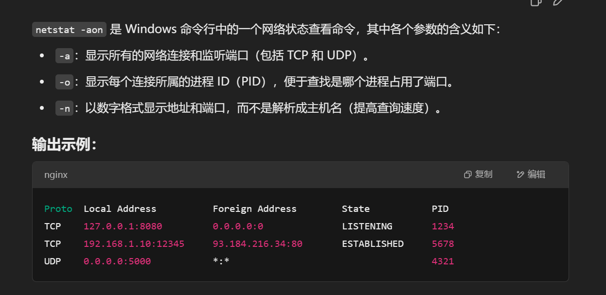
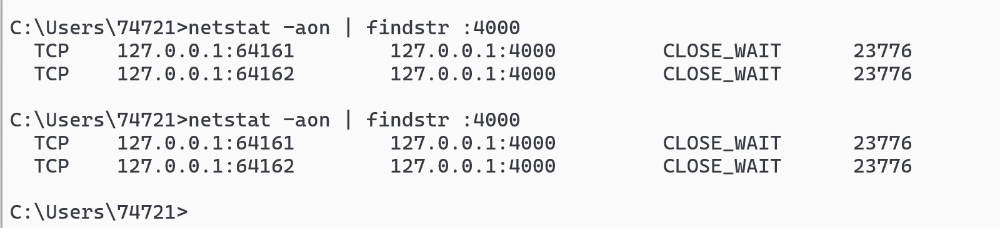
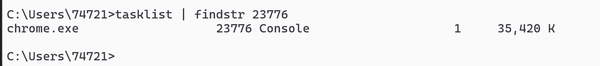

<h1 align = "center">Windows 运维</h1>

```sh
git init
git commit -m "first commit"
git branch -M master
git remote add origin git@github.com:lushiheng123/windows-.git
git push -u origin master
```

# 1. 端口指令 `netstat -aon`



### 查看具体端口 `netstat -aon | findstr :4000`



# 2. 程序任务指令`tasklist`,`tasklist | findstr 23776`查看具体 PID 进程（具体哪个进程的程序和端口）


